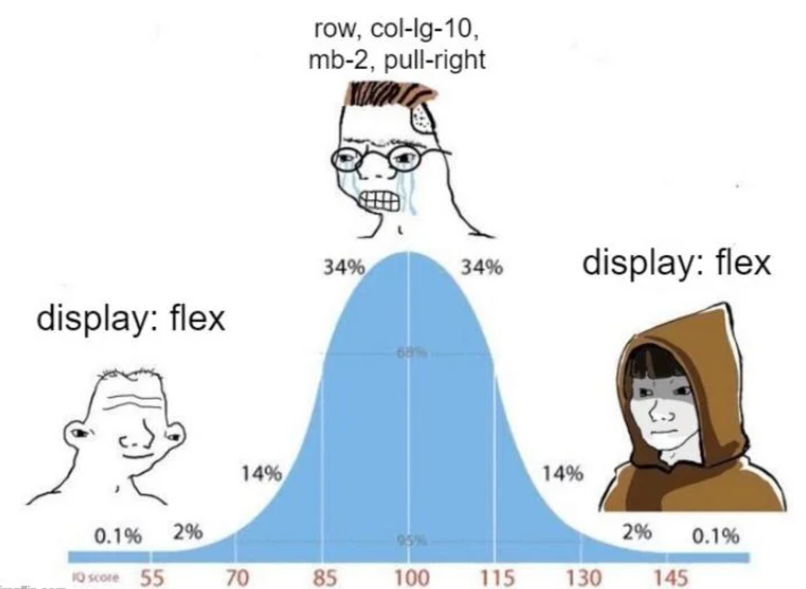

# Forssa Training Exercise

The exercise was supposed to be done using bootstrap but I feel like I deviated from it. Don't mind the naming of the css classes or how it was done, I really didn't care about the code, just wanted to finish the task and get done with it.

